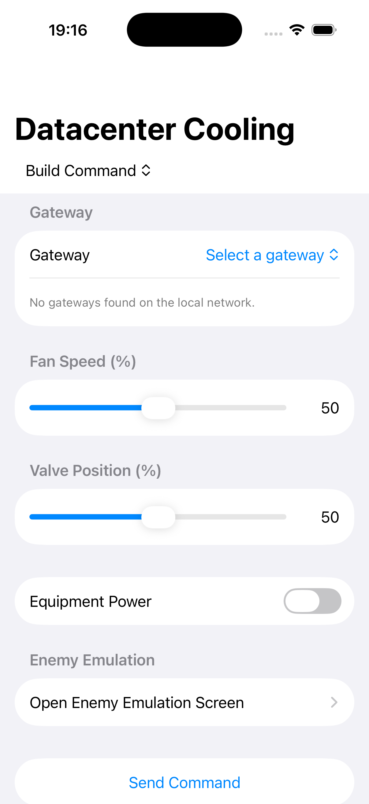
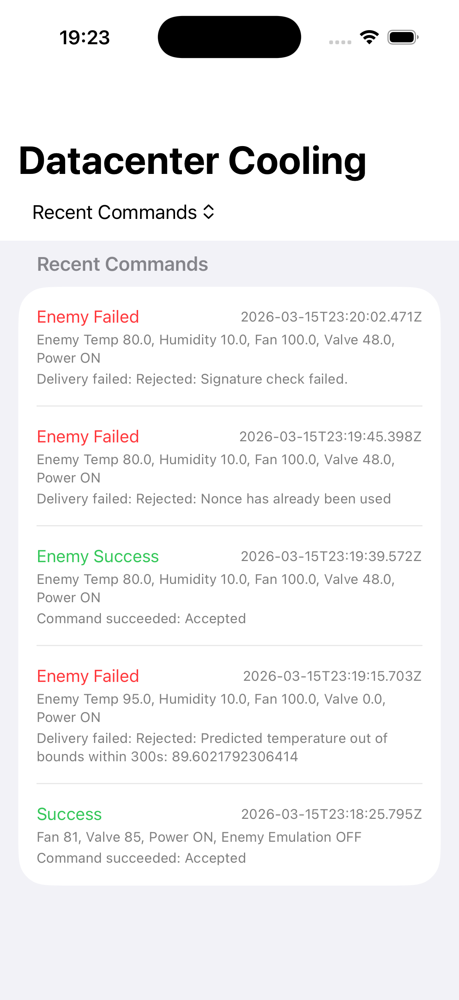
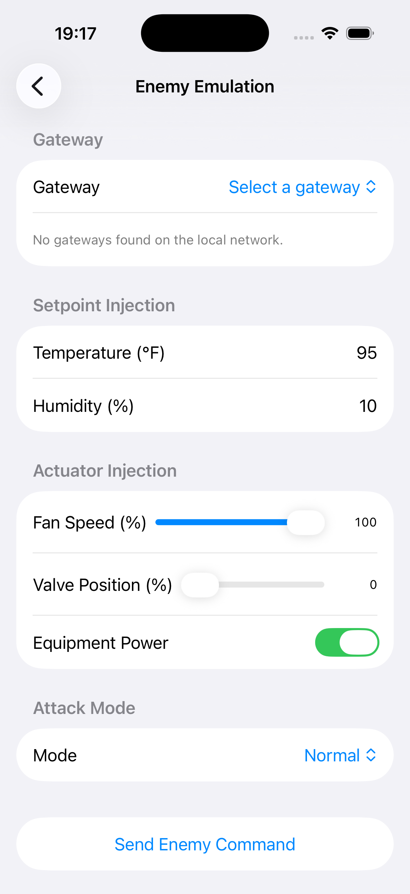
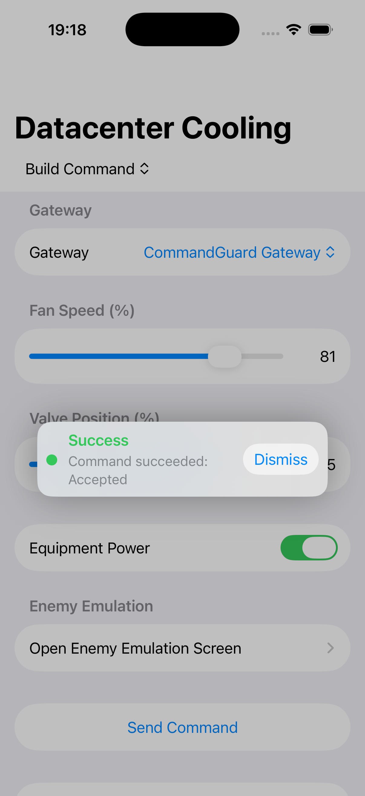
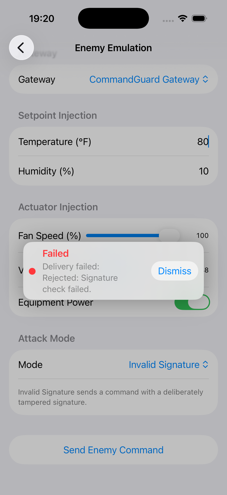
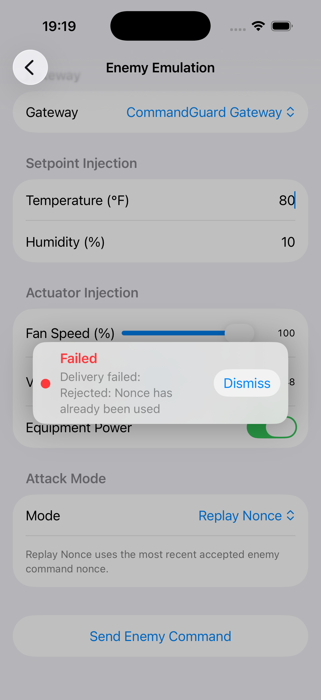
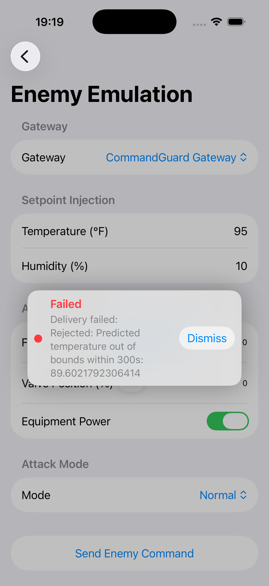
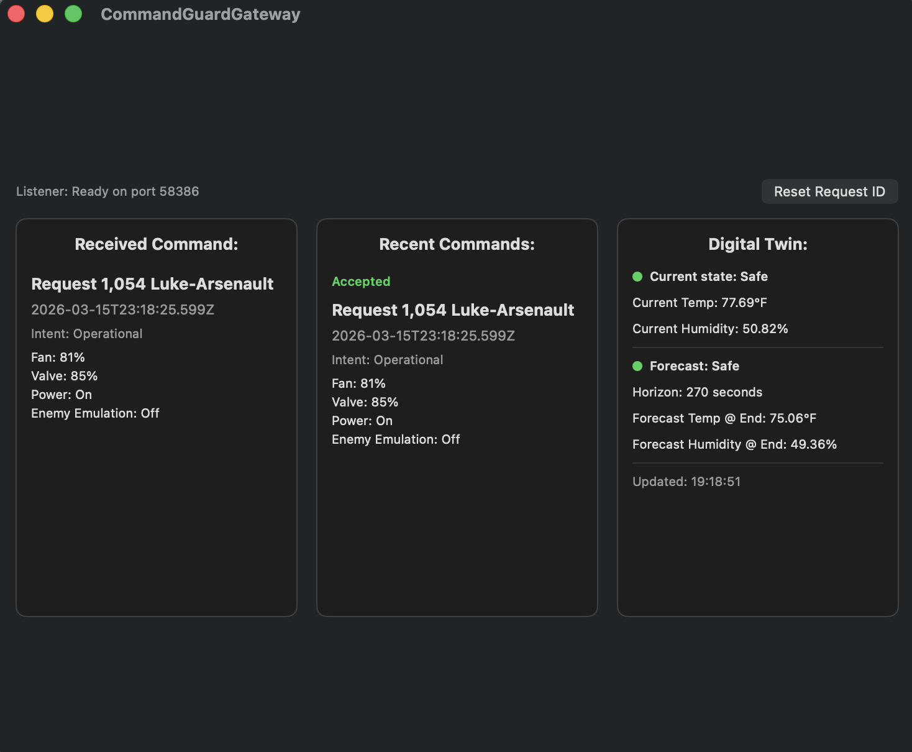
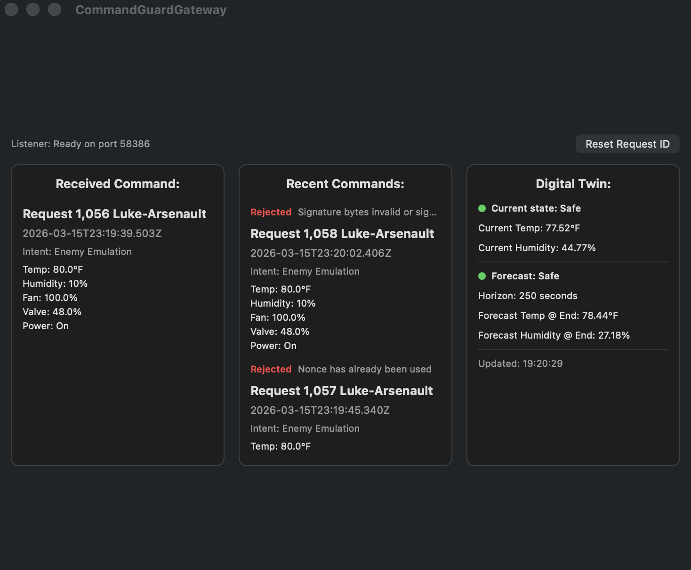

# 🔐 CommandGuard
### Secure Command Verification for Mobile-to-ICS Control

**Luke Arsenault**  
Georgia Institute of Technology

---

## 🚀 Overview

**CommandGuard** is a prototype security architecture that demonstrates how control commands issued from mobile devices can be safely validated, verified, and tested before reaching an industrial control system (ICS).

The project consists of:
- A **SwiftUI-based iOS application** that constructs and cryptographically signs simulated control commands
- A **SwiftUI-based MacOS verification gateway** that validates command authenticity, freshness, and physical safety
- A **lightweight digital twin** used to prevent unsafe cyber-physical actions

---

## 🏗️ System Architecture

```
┌────────────┐     Signed Command     ┌────────────────┐     Validated Command
│   iOS App  │ ───────────────────▶ │  macOS Gateway  │ ───────────────────▶ │  MODBUS Print-out
└────────────┘                        └────────────────┘
                                           │
                                           ▼
                                   Digital Twin & Safety Checks
```

---

## 📱 iOS Command Application

The iOS app simulates a mobile operator interface for a data center cooling system.

**Supported Parameters**
- Temperature Setpoint (°F) (In Enemy Emulator)
- Humidity Setpoint (%) (In Enemy Emulator)
- Fan Speed (%)
- Valve Position (%)
- Equipment Power
- Replay Nonce (In Enemy Emulator)
- Invalid Signature (In Enemy Emulator)

Each command is canonicalized, signed (ECDSA P-256 / SHA-256), timestamped, nonced, and logged. Below are screenshots showing the UI of the iOS app. 

<a href="CommandGuardApp/images/ios-home.png">
  
</a>

<a href="CommandGuardApp/images/ios-history.png">
  
</a>

<a href="CommandGuardApp/images/ios-enemyemulation.png">
  
</a>

<a href="CommandGuardApp/images/ios-acceptedcommand.png">
  
</a>

<a href="CommandGuardApp/images/ios-invalidsignature.png">
  
</a>

<a href="CommandGuardApp/images/ios-noncereplay.png">
  
</a>

<a href="CommandGuardApp/images/ios-outofbounds.png">
  
</a>

<a href="CommandGuardApp/images/macos-acceptedcommand.png">
  
</a>

<a href="CommandGuardApp/images/macos-rejectedcommands.png">
  
</a>

---

## 🖥️ macOS Verification Gateway

The gateway verifies cryptographic authenticity, prevents replay attacks, simulates commands via a digital twin, and enforces safety thresholds before forwarding or blocking commands.

---

## 🧪 Digital Twin & Safety Enforcement

Commands are evaluated against a simulated ICS state to ensure physical safety, not just cryptographic correctness.

---

## 🔒 Security Features

- Canonicalized JSON encoding
- ECDSA P-256 / SHA-256 signatures
- Unique nonce per command
- Timestamp validation
- Centralized enforcement

---

## 🎯 Threats Addressed

- Command tampering
- Replay attacks
- Unauthorized execution
- Unsafe physical actions

---

## 📂 Project Structure

```
├── CommandGuardApp.swift                  # iOS app entry point and SwiftData container setup
├── HomeView.swift                         # Main iOS UI for building and sending commands
├── HomeViewModel.swift                    # iOS state management and send flow orchestration
├── Shared/CommandModels.swift             # Shared command body/envelope/signature models and helpers
├── CryptoSigner.swift                     # Keychain-backed ECDSA P-256 / SHA-256 signer
├── CommandSendService.swift               # iOS send pipeline to gateway and response handling
├── GatewayService.swift                   # Discovered Bonjour gateway model (stable ID/display name)
├── BonjourBrowser.swift                   # Bonjour discovery helper for local gateway services
├── GatewayResponse.swift                  # iOS-side gateway response models and NDJSON parsing
├── EnemyEmulationView.swift               # iOS adversarial testing/emulation UI
├── RecentCommandsView.swift               # iOS recent command history UI
├── SendStatus.swift                       # Send state enum and UI status styling helpers
├── Item.swift                             # Default SwiftData template model (iOS)
├── Info-iOS.plist                         # iOS target Info.plist configuration
├── Assets.xcassets                        # iOS target asset catalog
├── images/ios-home.png                    # README screenshot: iOS home screen
├── images/ios-history.png                 # README screenshot: iOS history screen

├── CommandGuardGatewayApp.swift           # macOS gateway app entry point
├── ContentView.swift                      # macOS gateway UI (status + inbox display)
├── GatewayListener.swift                  # TCP listener for incoming NDJSON command envelopes
├── GatewayInbox.swift                     # In-memory/storage model for decoded received commands
├── GatewaySignatureVerifier.swift         # Signature verification for command envelopes
├── GatewayKeyStore.swift                  # Trusted public key store used by verifier
├── GatewayCommandValidator.swift          # Gateway-side command policy/validation rules
├── GatewayResponse.swift                  # Gateway-side response payload model
├── Item.swift                             # Default SwiftData template model (macOS)
├── Info-MacOS.plist                       # macOS target Info.plist configuration
├── CommandGuardGateway.entitlements       # macOS gateway entitlements/capabilities
├── Assets.xcassets                        # macOS target asset catalog

├── CommandModels.swift     # Shared command body/envelope/signature models and helpers
├── GatewayCommand.swift    # Shared gateway command type(s) used across targets
└── DigitalTwinModel.swift  # Shared digital twin domain/state model
```

---

## 📌 Scope & Limitations

This is a research prototype using simplified discovery, key management, and modeling.

---

## 📄 License

Academic and research use.

## AI Usage

All files in this project were developed with the assistance of the generative AI tool ChatGPT. All pieces of the files have been assisted by AI.
All AI-generated content was reviewed for understanding and cleanliness, tested for correctness and expected results,
and verified by Luke Arsenault.
